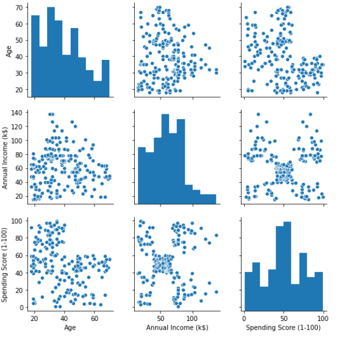

# Customer Analytics

## Table of Content

- [Overview](#overview)
- [Metrics/KPIs](#metrics-kpis)
- [SQL Results](#sql-results)
- [Mall Customers Segmentation](#mall-customers-segmentation)
- [Credits](#credits)
- [References](#references)

## Overview

This project uses Online Retail dataset to perform Customer Analytics, we try to cover main metrics and KPIs such as Churn Rate, Retention Rate, Customer Lifetime Value, Conversion Rate,  Customer Acquisition Cost, Monthly Active Users and Customer Segmentation.

**Note**: I will be updating this repo frequently to add more metrics.


## Metrics KPIs

### Customer Lifetime Value = (Customer Value * Average Customer Lifespan) [1]
### Customer Value = (Average Purchase Value * Average Number of Purchases) [1]
### Average Purchase Frequency Rate = (Number of Purchases / Number of Customers) [1]
### Average Purchase Value = (Total Revenue / Number of Orders) [1]
### Customer Value = (Average Purchase Value * Average Purchase Frequency Rate) [1]


<br>

## SQL Results

```
-- Average Purchase Value -- APV
Select round( Sum((Cast(UnitPrice as float)*Cast(Quantity as float))) / Count(Distinct InvoiceNo), 2) as average_purchase_value
From [Online Retail]

-- Average Purchase Frequency Rate -- APF
Select round( Count(Distinct InvoiceNo) / Count(Distinct CustomerID), 2) as average_purchase_value
From [Online Retail]

-- Customer Value = APV * APF
Select round( Sum((Cast(UnitPrice as float)*Cast(Quantity as float))) / Count(Distinct InvoiceNo), 2) * round( Count(Distinct InvoiceNo) / Count(Distinct CustomerID), 2) as value
From [Online Retail]
Where ISNUMERIC(Quantity)=1 and ISNUMERIC(UnitPrice)=1

-- Customer Lifetime Value = Customer Value * Average Customer Lifespan [2]
-- Average Customer Lifespan [2] = 1/Churn Rate (other methods are available)
With first_month_customers as (
	Select Count(Distinct CustomerID) as count
	From [Online Retail] 
	Where Year(InvoiceDateFormatted)=2011 and Month(InvoiceDateFormatted)=1
),
last_month_customers as (
	Select Count(Distinct CustomerID) as count
	From [Online Retail] 
	Where Year(InvoiceDateFormatted)=2011 and Month(InvoiceDateFormatted)=12
),
customer_value as (
	Select CustomerID, round( Sum((Cast(UnitPrice as float)*Cast(Quantity as float))) / Count(Distinct InvoiceNo), 2) * round( Count(Distinct InvoiceNo) / Count(Distinct CustomerID), 2) as value
	From [Online Retail] -- [Online Retail]
	Where ISNUMERIC(Quantity)=1 and ISNUMERIC(UnitPrice)=1
	Group By CustomerID
)
Select CustomerID,
	   (1 / ( Cast((first_month_customers.count - last_month_customers.count) as float) / Cast((first_month_customers.count) as float) )) * customer_value.value as CLV
From first_month_customers, last_month_customers, customer_value
Order By CLV DESC
```

**Note**: Due to dataset limitation, I'm using the unit price as a revenue in calculations.

## Mall Customers Segmentation

Here we make customers segments based on their Income and Spending Score. Please check the customers_segmentation.ipynb nootbook, [click here](customers_segmentation.ipynb)



<br> <br> <br>

## Credits

The Customer Clustering is inspired from [Absent Data](https://www.youtube.com/watch?v=iwUli5gIcU0) Youtube Channel, the data from there as well


## References

[1] https://blog.hubspot.com/service/how-to-calculate-customer-lifetime-value

[2] https://www.zoho.com/subscriptions/guides/what-is-customer-lifetime-value-clv.html


